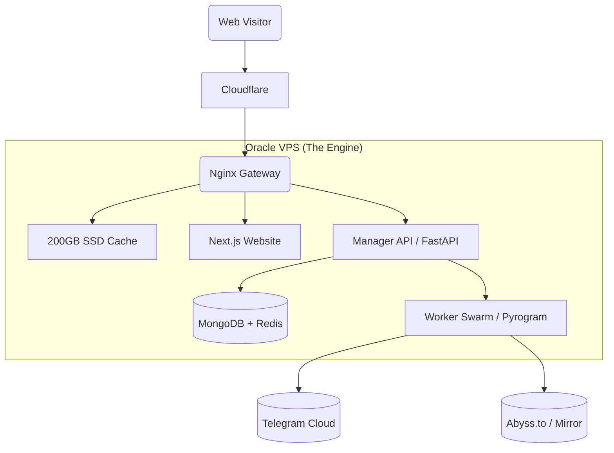

### 📂 File 1: `README.md`
*(Updated with V1 context and strict phase links)*

# 🎬 StreamVault Ecosystem (V2)
> **The Zero-Cost Enterprise Streaming Network**  
> *Turning "Always Free" Cloud Infrastructure into a Netflix-Scale Streaming Service.*

  

---

## 📖 Executive Summary
StreamVault is a microservices-based **Content Delivery Network (CDN)** designed to host, index, and stream terabytes of video content using **Telegram** as unlimited backend storage and **Oracle Cloud (Free Tier)** as the high-speed delivery engine.

Unlike standard Telegram bots, StreamVault separates the **Application Logic** (Manager) from the **Heavy Lifting** (Worker Swarm), utilizing a custom **Nginx Slice Caching** layer to serve viral content directly from disk—saving bandwidth and preventing API bans.

---

## 🏗️ System Architecture
The system runs as a **Single-Node Docker Cluster** (Docker Compose) on an Oracle Ampere A1 server (4 vCPU, 24GB RAM).



### 📂 Monorepo Structure
We use a unified codebase to manage both V2 (StreamVault) and Lite (ReadVault).

```text
/
├── apps/
│   ├── web/               # Next.js Frontend (Unified)
│   ├── manager/           # FastAPI Brain (Auth/DB/Search)
│   ├── worker-video/      # Pyrogram Leech/Stream Logic (StreamVault)
│   └── worker-manga/      # Gallery-DL Leech Logic (ReadVault)
├── packages/
│   ├── db/                # Shared MongoDB Models (Schemas)
│   └── ui/                # Shared Glassmorphism Components
└── docs/                  # The Blueprint Context Files
```
---

## 🗺️ Project Roadmap & Blueprints
The project documentation is split into three specific architectural domains. **Refer to these files in the `docs/` folder before starting development.**

### **Phase 2: Oracle Cloud Migration (Active)**

#### 🧱 [Blueprint 2.1: Infrastructure & Backend](./docs/new_v2_blueprint/context_01_infrastructure.md)
> *The Engine Room.* Details the Docker Compose setup, Nginx Slice Caching rules, Prometheus Monitoring, and Security Tunnels (Cloudflare).

#### 🔭 [Blueprint 2.2: Frontend Web Experience](./docs/new_v2_blueprint/context_02_frontend_ux.md)
> *The User Experience.* Covers the Next.js Glassmorphism UI, Video Player interactions (Soft Subtitles, Shortcuts), Authentication (Magic Links/QR), and Ad-Revenue logic.

#### 🤖 [Blueprint 2.3: Telegram Microservices](./docs/new_v2_blueprint/context_03_telegram_logic.md)
> *The Logic Core.* Explains the Manager Bot (Admin), Worker Swarm (Load Balancing), Ingestion Pipelines (Leech/Zip), and Abuse Handling systems.

*(Note: Phase 1 Legacy Code is deprecated. V2 is a full architectural rewrite).*

---

## ✨ Competitive Edge (Features)

### 💰 Monetization & Growth
- **Public First Model:** Users can watch as "Guests" (monetized via Ads) or log in via Telegram for Premium perks.
- **Referral Viral Loop:** Built-in system where users invite friends to unlock 4K quality/Premium speeds.
- **SEO Automation:** Automated Sitemaps and JSON-LD Rich Snippets for organic Google traffic.

### 🛡️ Safety & Stability
- **Swarm Rotation:** Downloads are load-balanced across 10+ Worker Sessions to prevent Telegram Flood Bans.
- **White-Label Proxy:** All traffic (Images/Video) is proxied through the API; users/trackers never see Telegram URLs.
- **Global Kill Switch:** `/takedown [ID]` command instantly purges content from Database, Nginx Cache, and Source Channel for DMCA compliance.

### 🎥 The Experience
- **"Obsidian Glass" UI:** A modern, dark-mode interface with blurry glass aesthetics.
- **Multi-Quality Buckets:** Aggregates 4K, 1080p, and 720p files under a single Movie Title.
- **On-The-Fly Zipping:** Users can download "Season Packs" (20GB+) as a single zip file generated in real-time.

---

## 🚀 Quick Deployment (Oracle OCI)

### Prerequisites
1.  **Oracle Cloud Account** (Always Free Tier - Ampere A1).
2.  **Domain Name** linked to Cloudflare DNS.
3.  **10+ Telegram Accounts** (Session Strings) for the Worker Swarm.

### Installation
```bash
# 1. Access the VPS
ssh ubuntu@your-oracle-ip

# 2. Clone Repo
git clone https://github.com/YourName/streamvault-v2.git /app/streamvault
cd /app/streamvault

# 3. Permissions (Critical for Mongo/Nginx)
sudo chown -R 1000:1000 data/

# 4. Config
cp .env.example .env
nano .env

# 5. Ignite the Swarm
docker compose up -d --build
```

### Initial Setup
**Generating Sessions:**
> 1.  Run the helper script locally: `python3 scripts/generate_session.py`
> 2.  Enter API Key, Hash, and Phone Number.
> 3.  Enter OTP.
> 4.  Copy the resulting `.session` file to `config/workers/` on the server.

1.  Send `/login` to your Manager Bot to get the Super Admin Magic Link.
2.  Use the `/import` command (if applicable) to sync legacy channels.
3.  Add your Worker Session strings to `config/workers/`.
---
### ⚡ Phase 2-Lite: ReadVault Deployment (No Oracle Required)
If you do not have a VPS yet, deploy the **ReadVault Module** on free tiers.

1.  **Hugging Face:** Deploy `apps/manager` and `apps/worker-manga`.
    *   Set `MODE=LITE` in env variables.
    *   Set `STORAGE_TYPE=TELEGRAM`.
2.  **Vercel:** Deploy `apps/web`.
    *   Set `NEXT_PUBLIC_API_URL` to your Hugging Face Space URL.
3.  **Result:** You now have a working Manga/Manhwa Reader.
---

**Real limits of our Project StreamVault(Docker Swarm) with Oracle Free Plan**

### 📊 The Worker Capacity Table
*Basis: 1080p Quality (~5 Mbps Bitrate). Values assume stable "Safe Zone" operation to avoid FloodWait Bans.*

| Workers | Safe Concurrent Users | Max Burst Limit (Risk of Buffer) | Est. Bandwidth Load |
| :--- | :--- | :--- | :--- |
| **1 Worker** | **15 - 20 Users** | 30 Users | ~100 Mbps |
| **2 Workers** | **30 - 40 Users** | 60 Users | ~200 Mbps |
| **3 Workers** | **45 - 60 Users** | 90 Users | ~300 Mbps |
| **4 Workers** | **60 - 80 Users** | 120 Users | ~400 Mbps |
| **5 Workers** | **75 - 100 Users** | 150 Users | ~500 Mbps |
| **6 Workers** | **90 - 120 Users** | 180 Users | ~600 Mbps |
| **7 Workers** | **105 - 140 Users** | 210 Users | ~700 Mbps |
| **8 Workers** | **120 - 160 Users** | 240 Users | ~800 Mbps |
| **9 Workers** | **135 - 180 Users** | 270 Users | ~900 Mbps |
| **10 Workers** | **150 - 200 Users** | 300 Users | ~1.0 Gbps |

*(Note: "Safe Concurrent Users" means 20 people watching without a single buffer wheel.)*

---

### 🧮 The Calculation Methodology

Here is the engineering math used to arrive at these numbers. It is based on **Telegram's API Limits (MTProto)**, not your server's limits.

#### 1. The Bottleneck: "Request Frequency"
Telegram doesn't limit "Speed" (Mbps); they limit "Requests Per Second" (FloodWait).
*   When a user watches a movie, your server requests data in **1 MB Chunks**.
*   **Video Bitrate (1080p):** ~5 Mbps = ~0.625 MB/s.
*   **Request Rate:** 1 User = ~1 API Request every 1.5 seconds.
*   **The Wall:** A single Telegram Session (`api_id` + `session_string`) typically triggers a `420 FLOOD_WAIT` protection error if it receives > 30-40 simultaneous chunk requests per second.

#### 2. The Formula
$$
\text{Total Users} = \frac{\text{Worker Requests Limit}}{\text{User Request Frequency}} \times \text{Safety Margin}
$$

*   **Telegram Limit (Approx):** ~30 Chunk Requests / sec per Session.
*   **User Load:** ~1 Chunk Request / sec (including seeking/scrubbing bursts).
*   **Max Theoretical:** 30 Users per Worker.
*   **Safety Margin (50%):** We cut the theoretical limit by half because users tend to seek (Fast Forward) rapidly, which bursts the API requests.

$$ 30 \text{ Users} \times 0.6 \text{ (Safety Factor)} = \approx 18\text{-}20 \text{ Users Safe Limit per Account.} $$

#### 3. The Multiplier Effect (The "Swarm")
Since your code balances the load:
*   **10 Accounts x 20 Safe Users = 200 Users.**

### 💡 The "God Mode" (Nginx Factor)
**Critical Reminder:**
These numbers are ONLY for "Live Leeching" (Cache Misses).
*   If **150 Users** are watching *Avatar 3* (which is Cached on your Oracle SSD)...
*   **Workers Used:** 0
*   **Total Capacity:** **~800+ Concurrent Users** (Limited only by Oracle's 4Gbps Network).

**Verdict:** 10 Workers handle the "Tail" (rare movies). Nginx Cache handles the "Head" (popular movies). Together, they handle 1,000+ users.

*For **4K (2160p)** quality, the capacity drops significantly because the bitrate (data density) is 4x higher, forcing the bot to fetch data chunks 4x faster from Telegram.*

### 📊 4K / High Bitrate Capacity (Per Account)

| Quality | Bitrate (Avg) | Safe Concurrent Users |
| :--- | :--- | :--- |
| **4K WEB-DL** (Standard) | ~15-20 Mbps | **4 - 5 Users** |
| **4K REMUX** (Raw BluRay) | ~50-80 Mbps | **1 - 2 Users** |

**Why?**
High quality = More data per second. To keep the buffer filled, the bot must spam requests to Telegram API much faster, hitting the "Flood Wait" limit with fewer users.

**Strategic Tip:**
For 4K content, you should strictly enforce the **"Download"** button (or "Pre-Zipped Pack") instead of streaming, or use **Google Drive/PixelDrain etc..** links for the 4K versions to save your Telegram workers.

---

## 📜 License
*Proprietary Source-Available Software.*  
Designed for educational research on High-Load Telegram Systems.
